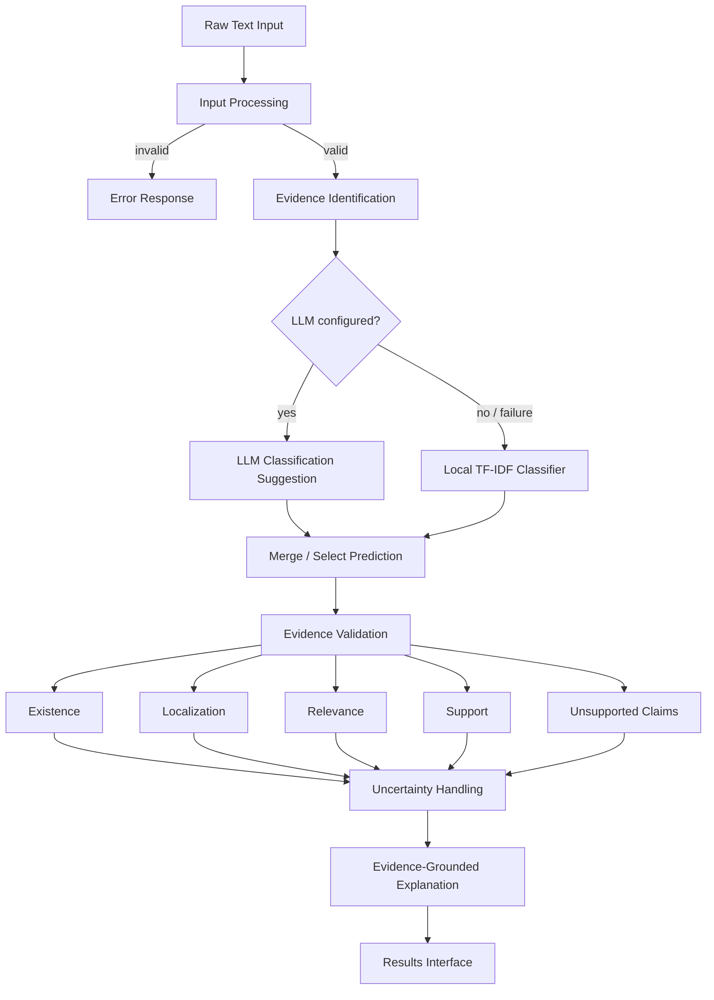
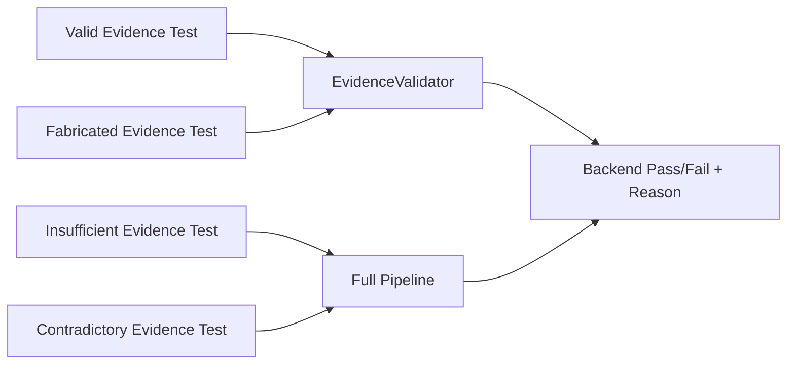

# Workflow Diagram

```mermaid
flowchart TD
    A[Raw Text Input] --> B[Input Processing]
    B -->|invalid| Z[Error Response]
    B -->|valid| C[Evidence Identification]
    C --> D{LLM configured?}
    D -->|yes| E[LLM Classification Suggestion]
    D -->|no / failure| F[Local TF-IDF Classifier]
    E --> G[Merge / Select Prediction]
    F --> G
    G --> H[Evidence Validation]
    H --> H1[Existence]
    H --> H2[Localization]
    H --> H3[Relevance]
    H --> H4[Support]
    H --> H5[Unsupported Claims]
    H1 --> I[Uncertainty Handling]
    H2 --> I
    H3 --> I
    H4 --> I
    H5 --> I
    I --> J[Evidence-Grounded Explanation]
    J --> K[Results Interface]
```

## Adversarial laboratory path

```mermaid
flowchart LR
    T1[Valid Evidence Test] --> V[EvidenceValidator]
    T2[Fabricated Evidence Test] --> V
    T3[Insufficient Evidence Test] --> P[Full Pipeline]
    T4[Contradictory Evidence Test] --> P
    V --> R[Backend Pass/Fail + Reason]
    P --> R
```
